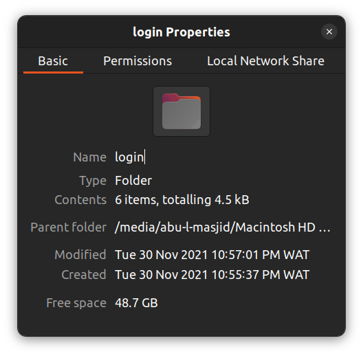

# PHP Login System with Responsive Error Handling

This repository contains a robust login system developed during my self-learning journey in PHP. From Dani Krossing's YouTube tutorial, this project is a standalone implementation that highlights secure user authentication and advanced error handling techniques. Created and completed on Tue, 30th Nov 2021.

## Features

- **Secure User Authentication:** Users can sign up and log in with their credentials securely.
- **Responsive Error Handling:** The system identifies and responds to key errors, such as:
  - Empty form fields.
  - Invalid or improperly formatted input.
  - Incorrect login credentials.
- **Seamless User Experience:** Clear and concise feedback is provided for error resolution.
- **Learning-Focused Implementation:** Designed with simplicity and clarity to demonstrate core concepts.

## Project Structure

Here’s an overview of the project structure:

### Key Files

- `index.php`: The main entry point of the application.
- `signup.php`: Handles user sign-up functionality.
- `login.inc.php`: Processes user login requests.
- `dbh.inc.php`: Establishes the database connection.
- `logout.php`: Logs out the user and destroys their session.

### Database Setup

- A **MySQL database** is used to store user credentials securely.
- Sample SQL schema and basic setup scripts are included in the repository to get started.

## Screenshots

Here's a screenshots of the project folder properties:

## Learning Outcomes

This project allowed me to:

1. Gain hands-on experience with PHP and MySQL integration.
2. Understand the importance of robust error handling in web development.
3. Build a reusable and modular login system.

## License

This repository is shared without any specific license, as it primarily serves as an educational archive.
